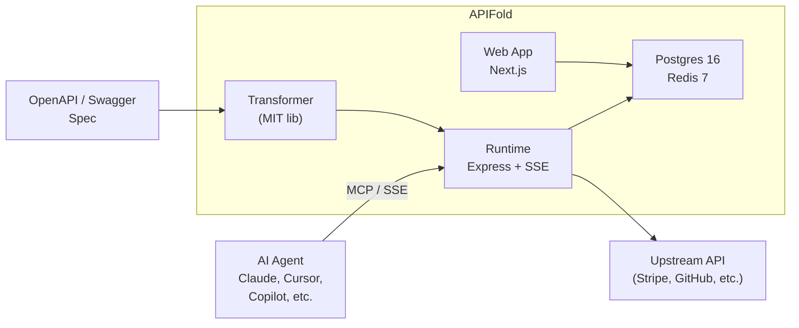

<p align="center">
    <a href="https://apifold.dev" target="_blank"></a>
    <br />
    <br />
    <b>Turn any REST API into an MCP server. No code required.</b>
    <br />
    <br />
</p>

[](https://github.com/Work90210/APIFold/actions)
[](./LICENSE)
[](./packages/transformer/LICENSE)
[](https://nodejs.org)
[](https://pnpm.io)
[](https://hub.docker.com/r/apifold/apifold)

## What is this?

APIFold is an open-source platform that turns any OpenAPI 3.x or Swagger 2.x specification into a live, production-ready [MCP](https://modelcontextprotocol.io) server. MCP (Model Context Protocol) is the emerging standard that lets AI agents -- Claude, Cursor, Copilot, Windsurf, and others -- discover and call external tools. APIFold bridges the gap: point it at your existing REST API spec, and AI agents can start using your API immediately. No stubs, no mocks, no glue code.

The platform handles the hard parts for you: credential encryption, upstream proxying, rate limiting, circuit breakers, usage metering, and per-tool access control. Import a spec, configure auth, and connect your AI client in minutes. Self-host on your own infrastructure with Docker Compose, or use the managed cloud platform with built-in billing and usage tracking.

## Quick Start

### Hosted (Cloud)

1. **Sign up** at [apifold.dev](https://apifold.dev)
2. **Import** your OpenAPI spec (URL or file upload)
3. **Connect** your AI client using the generated config snippet

### Self-Host (Docker Compose)

```bash
git clone https://github.com/Work90210/APIFold.git
cd APIFold
cp .env.example .env
# Edit .env with your secrets — see https://apifold.dev/docs/self-hosting#configuration
docker compose -f infra/docker-compose.yml up -d
```

Open [http://localhost:3000](http://localhost:3000) to access the dashboard.

For advanced configuration, see the [Self-Hosting Guide](https://apifold.dev/docs/self-hosting).

## How It Works

APIFold follows a three-stage pipeline:

1. **Import** -- You provide an OpenAPI spec (URL or file). The transformer parses every path and method into MCP tool definitions with typed input schemas.
2. **Serve** -- An Express-based MCP runtime hosts your tools over SSE (Server-Sent Events). When an AI agent calls a tool, the runtime decrypts your stored credentials, injects authentication headers, and proxies the request to your upstream API.
3. **Manage** -- A Next.js dashboard gives you full control: enable or disable individual tools, set rate limits, view request logs, test tools interactively, and export your server as standalone code.

All components communicate through PostgreSQL (persistent state) and Redis (sessions, rate counters, pub/sub config updates). The architecture supports horizontal scaling via cluster mode and Redis-coordinated session management.

## Documentation

Full documentation is available at [apifold.dev/docs](https://apifold.dev/docs), covering:

- [Getting Started](https://apifold.dev/docs/getting-started)
- [Importing Specs](https://apifold.dev/docs/import-spec)
- [Server Configuration](https://apifold.dev/docs/configure-server)
- [Connecting AI Clients](https://apifold.dev/docs/connect-claude)
- [API Reference](https://apifold.dev/docs/api-reference)
- [Self-Hosting](https://apifold.dev/docs/self-hosting)

## Packages

| Package | Path | License | Description |
|---------|------|---------|-------------|
| `@apifold/transformer` | [`packages/transformer`](packages/transformer) | MIT | Core conversion library. Pure functions that turn OpenAPI specs into MCP tool definitions. Use it in your own tools with no AGPL obligations. |
| Full Platform | [`apps/`](apps), [`packages/`](packages) | AGPL-3.0 | Dashboard, runtime, database layer, billing, and infrastructure. |

### Using the Transformer Standalone

```bash
npm install @apifold/transformer
```

```typescript
import { parseSpec, transformSpec } from "@apifold/transformer";

const parsed = parseSpec({ spec: myOpenApiSpec });
const result = transformSpec({ spec: parsed.spec });
// result.tools contains MCP-compatible tool definitions
```

## Architecture



| Component | Path | Description |
|-----------|------|-------------|
| **Transformer** | [`packages/transformer`](packages/transformer) | Core conversion library. Spec in, MCP tools out. Pure functions, no side effects. **MIT licensed.** |
| **Runtime** | [`apps/runtime`](apps/runtime) | Express server hosting live MCP endpoints over SSE. Handles credential decryption and upstream proxying. |
| **Web App** | [`apps/web`](apps/web) | Next.js 14 dashboard. Import specs, configure servers, manage credentials, test tools, inspect logs. |
| **Types** | [`packages/types`](packages/types) | Shared TypeScript type definitions. |
| **UI** | [`packages/ui`](packages/ui) | Design system and component library. |

For detailed architecture decisions, see the [Architecture Decision Records](docs/ARCHITECTURE.md).

## Development

```bash
pnpm install
cp .env.example .env
docker compose -f infra/docker-compose.dev.yml up -d
pnpm dev
```

| Command | Description |
|---------|-------------|
| `pnpm dev` | Start all services with hot-reload |
| `pnpm build` | Build all packages |
| `pnpm test` | Run tests |
| `pnpm lint` | Lint all packages |
| `pnpm typecheck` | Type-check all packages |
| `pnpm format` | Format all files with Prettier |
| `pnpm db:migrate` | Run database migrations |
| `pnpm db:seed` | Seed development data |
| `pnpm db:studio` | Open Drizzle Studio |

## Contributing

All code contributions, including those of people having commit access, must go through a pull request and be approved before being merged. This is to ensure a proper review of all the code.

See the [contribution guide](docs/CONTRIBUTING.md) for development setup and guidelines.

## Security

For security issues, please refer to our [security policy](docs/SECURITY.md) for responsible disclosure guidelines. Do not post security vulnerabilities as public GitHub issues.

## License

This repository uses a dual-license model:

- **[`@apifold/transformer`](packages/transformer)** is available under the [MIT License](packages/transformer/LICENSE). Use it anywhere, no strings attached.
- **Everything else** is available under the [GNU Affero General Public License v3.0](LICENSE).

This is the same model used by [Grafana](https://grafana.com), [Plausible](https://plausible.io), and [PostHog](https://posthog.com).
