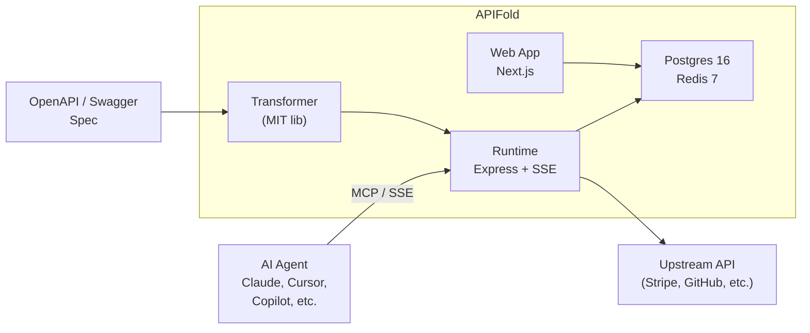

<br />
<p align="center">
    <a href="https://apifold.dev" target="_blank"></a>
    <br />
    <br />
    <b>Turn any REST API into an MCP server. No code required.</b>
    <br />
    <br />
</p>

[](https://github.com/Work90210/model-translator/actions)
[](./LICENSE)
[](./packages/transformer/LICENSE)
[](https://nodejs.org)
[](https://pnpm.io)

APIFold reads an OpenAPI 3.x or Swagger 2.x specification and generates a live, production-ready [MCP](https://modelcontextprotocol.io) server endpoint. AI agents — Claude, Cursor, Copilot, or any MCP-compatible client — can connect immediately. Tool calls execute real HTTP requests to real upstream APIs with securely stored credentials. No stubs, no mocks, no glue code.

<!--  -->

Table of Contents:

- [Installation](#installation)
- [Self-Hosting](#self-hosting)
- [Getting Started](#getting-started)
  - [Using the Transformer Library](#using-the-transformer-library)
  - [Connecting an AI Agent](#connecting-an-ai-agent)
- [Architecture](#architecture)
- [Contributing](#contributing)
- [Security](#security)
- [License](#license)

## Installation

Before running the installation command, make sure you have [Node.js 20+](https://nodejs.org), [pnpm 9+](https://pnpm.io), and [Docker](https://www.docker.com/products/docker-desktop) installed on your machine:

```bash
git clone https://github.com/Work90210/model-translator.git
cd model-translator
pnpm install
```

## Self-Hosting

APIFold is designed to run in a containerized environment. Running your own instance is as easy as running one command from your terminal:

### Development

```bash
cp .env.example .env
docker compose -f infra/docker-compose.dev.yml up -d
pnpm dev
```

Open [http://localhost:3000](http://localhost:3000) to access the dashboard.

### Production

```bash
cp .env.example .env
# Edit .env with your production values (database, Redis, vault secret)
docker compose -f infra/docker-compose.yml up -d
```

The production stack includes Nginx reverse proxy, Next.js web app, Express MCP runtime, Postgres 16, and Redis 7 — all behind a single command. For advanced configuration, check out the [environment variables](.env.example) and [self-hosting guide](docs/SELF_HOSTING.md).

## Getting Started

### Using the Transformer Library

The core conversion logic is published as a standalone MIT-licensed npm package. You can use it in your own tools without any AGPL obligations:

```bash
npm install @apifold/transformer
```

```typescript
import { transform } from "@apifold/transformer";

const tools = transform(myOpenAPISpec);
// Returns MCP-compatible tool definitions
```

### Connecting an AI Agent

Once you've imported a spec and created an MCP server through the dashboard:

**Claude Desktop** — add to your `claude_desktop_config.json`:
```json
{
  "mcpServers": {
    "my-api": {
      "url": "http://localhost:3001/mcp/my-api/sse"
    }
  }
}
```

**Cursor** — add the same endpoint URL in Cursor Settings > MCP Servers.

### Available Commands

| Command | Description |
|---------|-------------|
| `pnpm dev` | Start all services with hot-reload |
| `pnpm build` | Build all packages |
| `pnpm test` | Run tests |
| `pnpm lint` | Lint all packages |
| `pnpm typecheck` | Type-check all packages |
| `pnpm format` | Format all files with Prettier |
| `pnpm db:migrate` | Run database migrations |
| `pnpm db:seed` | Seed development data |
| `pnpm db:studio` | Open Drizzle Studio |

## Architecture



APIFold uses a monorepo architecture built with [Turborepo](https://turbo.build) and [pnpm workspaces](https://pnpm.io/workspaces):

| Component | Path | Description |
|-----------|------|-------------|
| **Transformer** | [`packages/transformer`](packages/transformer) | Core conversion library. Spec in, MCP tools out. Pure functions, no side effects. **MIT licensed.** |
| **Runtime** | [`apps/runtime`](apps/runtime) | Express server hosting live MCP endpoints over SSE. Handles credential decryption and upstream proxying. |
| **Web App** | [`apps/web`](apps/web) | Next.js 14 dashboard. Import specs, configure servers, manage credentials, test tools, inspect logs. |
| **Types** | [`packages/types`](packages/types) | Shared TypeScript type definitions. |
| **UI** | [`packages/ui`](packages/ui) | Design system and component library. |

You can learn more about the architecture in the [Architecture Decision Records](docs/ARCHITECTURE.md).

## Contributing

All code contributions, including those of people having commit access, must go through a pull request and be approved before being merged. This is to ensure a proper review of all the code.

We truly :heart: pull requests! If you wish to help, you can learn more about how you can contribute to this project in the [contribution guide](docs/CONTRIBUTING.md).

## Security

For security issues, please refer to our [security policy](docs/SECURITY.md) for responsible disclosure guidelines. Do not post security vulnerabilities as public GitHub issues.

## License

This repository uses a dual-license model:

- **[`@apifold/transformer`](packages/transformer)** is available under the [MIT License](packages/transformer/LICENSE). Use it anywhere, no strings attached.
- **Everything else** is available under the [GNU Affero General Public License v3.0](LICENSE).

This is the same model used by [Grafana](https://grafana.com), [Plausible](https://plausible.io), and [PostHog](https://posthog.com).
